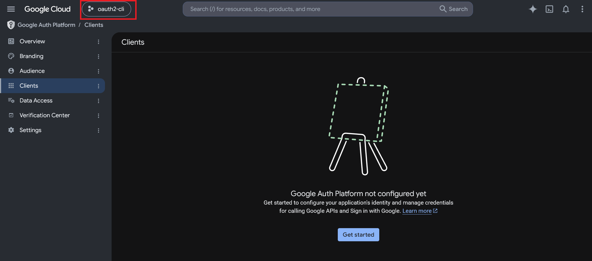
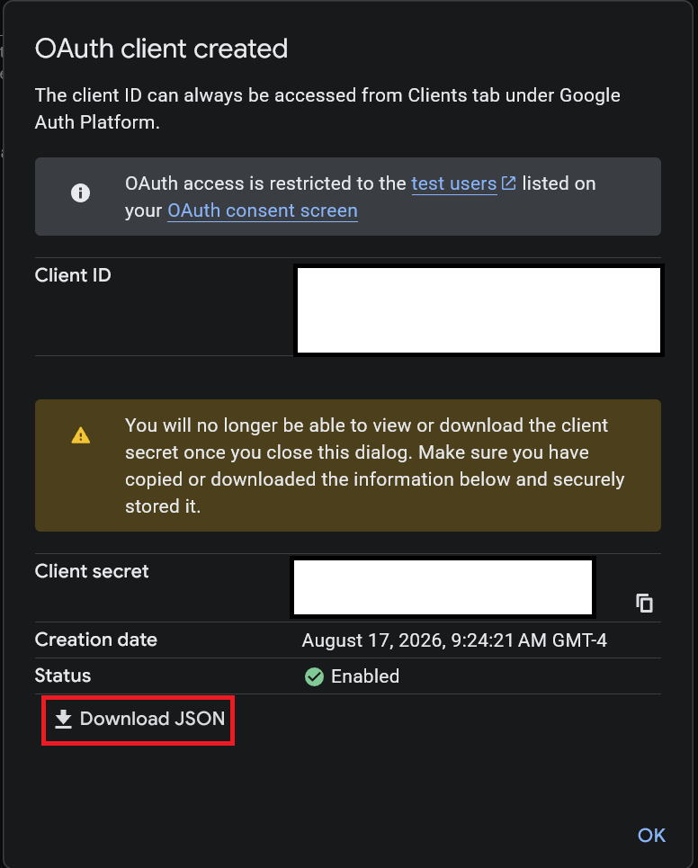

# Creating a Google Cloud OAuth2 Client

1. Navigate to https://console.developers.google.com/auth/clients.
2. Select a project or create a new one.
   
3. Follow the instructions to set up Google Auth Platform, if it isn't already.
   You can name your app whatever you want. Select "External" for the Audience.
4. Once you have an app set up, go back to [the Clients
   page](https://console.developers.google.com/auth/clients). Create a new
   client. Select "Desktop app" for your application type. You can name it
   whatever you want.
5. When the client is created, a dialog will show up. Make sure to click
   "Download JSON" before you close the dialog - you won't get another chance.
   Store the JSON file in a secure location - its contents are sensitive! (On a
   *nix system, ideally you should `chmod 0600` the file). The file will be
   called something starting with "client_secret", but it contains other
   metadata too. I call this the "Client Info" file.
   
6. If you want to be able to actually use the OAuth2 authentication to interact
   with APIs, you'll need to enable the APIs you want in the [API
   Library](https://console.cloud.google.com/apis/library). For example, if you
   want to call Gmail APIs, you'll need to [enable the Gmail
   API](https://console.cloud.google.com/apis/library/gmail.googleapis.com).
7. When it comes time to request access to OAuth Scopes, you'll need to look up
   the appropriate scopes in the API documentation. When you find out what
   scopes you need, you'll need to add them in the [Data
   Access](https://console.cloud.google.com/auth/scopes) settings.
8. While testing your app, you'll also need to add a test user to the
   [Audience](https://console.cloud.google.com/auth/audience) settings.
